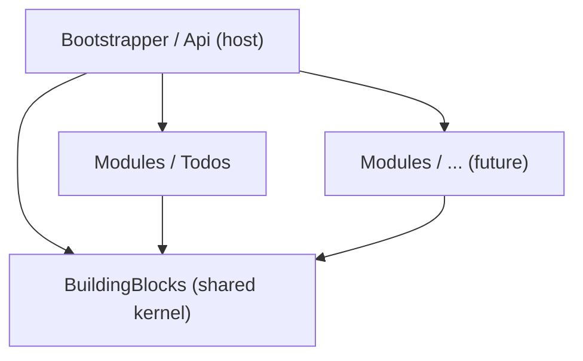

# ReadyTemplate — Documentation

A **.NET 10** Web API template built as a **Modular Monolith**: self-contained
feature modules behind a shared `BuildingBlocks` kernel, composed by a thin
host through a single `IModule` contract.

This folder is the full reference for how the template is put together and how
to extend it. If you just want to run it, start with **[Getting Started](getting-started.md)**.

## Table of contents

| Doc | What it covers |
|-----|----------------|
| [Getting Started](getting-started.md) | Prerequisites, running the API, database, Swagger, telemetry |
| [Architecture](architecture.md) | The big picture: modular monolith principles, dependency rules, project map |
| [Building Blocks](building-blocks.md) | The shared kernel: base types, exceptions, extensions, interceptors, registration helpers |
| [Modules](modules.md) | Module anatomy, the `IModule` contract, and its lifecycle in the host |
| [Adding a Module](adding-a-module.md) | End-to-end walkthrough: create a new `Products` module from scratch |
| [Persistence](persistence.md) | Schema-per-module, `ModuleDbContext`, migrations, audit trail, soft delete, GUID v7 |
| [CQRS & Validation](cqrs-validation.md) | Feature classes, commands/queries, PediatR, FluentValidation pipeline, Mapperly |
| [API & Endpoints](api-and-endpoints.md) | Minimal API groups, table queries, error handling, health checks |
| [Observability](observability.md) | OpenTelemetry traces, metrics, and logs over OTLP |
| [Testing](testing.md) | Unit tests and Testcontainers-backed integration tests |
| [Configuration](configuration.md) | `appsettings`, environment variables, CORS, feature flags |

## The one-minute version

```
src/
├── BuildingBlocks/     # Shared kernel — cross-cutting, module-agnostic
├── Modules/            # One self-contained vertical slice per feature
│   └── Todos/          #   The reference module (domain + app + infra + endpoints)
└── Bootstrapper/
    └── Api/            # Host — owns no business logic, just composes modules
```

- **A module owns everything it needs**: its domain, application logic, HTTP
  endpoints, and its own database schema + migrations.
- **The host owns nothing but composition**: cross-cutting concerns (auth
  context, observability, error handling) and a single list of modules.
- **Modules never reference each other directly** — only `BuildingBlocks`.
- **Adding a module is a one-line change** in `Program.cs`.



> Dependencies point **inward** to `BuildingBlocks`. The host points to the
> modules only to compose them; no module points to the host or to another module.
