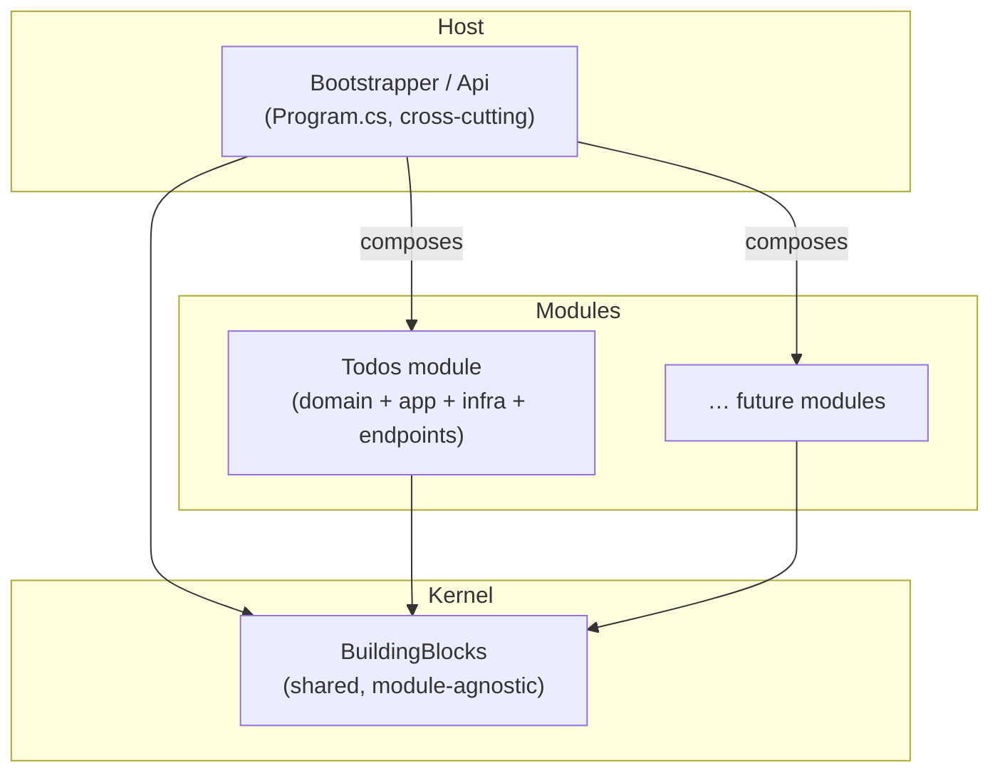

# Architecture

## Why a modular monolith

A **modular monolith** ships and runs as a single process (like a classic
monolith) but is organized internally as a set of **independent modules** with
enforced boundaries (like microservices, minus the network). You get:

- **Simple deployment & debugging** — one process, one call stack, transactions
  that span a single database.
- **Real boundaries** — each module owns its code and its data. Modules talk to
  the shared kernel, never to each other's internals.
- **A clean upgrade path** — if a module ever needs to become its own service,
  it already has its own schema, migrations, endpoints, and public surface.

This template contrasts with **Clean Architecture's horizontal layering**
(`Domain → Application → Infrastructure → Server`). Instead of slicing the
system by *technical concern*, it slices by *feature*: everything a feature
needs lives together in one project.

## The three tiers



### 1. `BuildingBlocks` — the shared kernel

Cross-cutting, feature-agnostic code every module can rely on: base entity
types, the audit model, common exceptions, table/query helpers, the mediator
validation behaviour, the `IModule` contract, EF interceptors, the
`ModuleDbContext` base, and the registration helpers the host uses.

It knows **nothing** about any specific module. See [Building Blocks](building-blocks.md).

### 2. `Modules/*` — the features

Each module is a **vertical slice** in a single project:

```
Modules/Todos/
├── TodosModule.cs        # IModule: registration + endpoints + migrations
├── Domain/               # entities
├── Application/          # ITodosDbContext, features, commands, views, validators, mapper
├── Infrastructure/       # TodosDbContext (own schema), EF configs, migrations
└── Endpoints/            # minimal API group
```

A module depends only on `BuildingBlocks`. See [Modules](modules.md).

### 3. `Bootstrapper/Api` — the host

The ASP.NET Core host. It owns **no business logic**. It:

- registers cross-cutting services (auth context, observability, error handling,
  health checks, CORS, Swagger),
- declares the set of modules, and
- delegates registration, endpoint mapping, and startup migration to them.

```csharp
// src/Bootstrapper/Api/Program.cs
IModule[] modules = [new TodosModule()];

services.AddModules(cfg, modules);        // shared infra + each module's services
// ...
app.MapModuleEndpoints(modules);          // each module maps its endpoints
if (cfg.GetValue<bool>("Database:AutoMigrate"))
    await app.Services.InitializeModulesAsync(modules);   // each module migrates itself
```

## Dependency rules

1. **Modules depend only on `BuildingBlocks`.** Never on the host, never on
   another module.
2. **The host depends on `BuildingBlocks` and on every module** — but only to
   compose them via `IModule`. It does not use module internals.
3. **`BuildingBlocks` depends on nothing in the solution.**

These rules are enforced by project references: a module's `.csproj` references
only `BuildingBlocks.csproj`.

## Data isolation

Isolation isn't only in code — it reaches the database:

- Each module has **its own `DbContext`** deriving from `ModuleDbContext`.
- Each module lives in **its own PostgreSQL schema** (e.g. `todos`).
- Each module keeps **its own migrations** and **its own migration-history
  table** (`todos.__ef_migrations_history`).
- Each module gets **its own audit table** inside its schema.

See [Persistence](persistence.md) for the details.

## Cross-module communication (when you need it)

This template ships with a single module, so there's no in-process messaging
yet. When a second module needs to react to another, keep the boundary intact:

- **Prefer contracts over internals** — expose a small public interface or
  integration event from the source module; never reach into its `DbContext`
  or entities.
- **In-process events** — publish/subscribe through the mediator (PediatR
  notifications) so the coupling stays at the contract level.
- **No shared tables** — a module reads another module's data through its public
  surface, not by querying its schema.

Keeping these disciplines is what preserves the "extract to a service later"
option.
