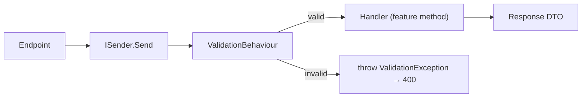

# CQRS & Validation

Each module exposes its behavior as **queries** and **commands** dispatched
through a mediator, validated by a pipeline, and mapped to DTOs by a
compile-time mapper.

## The pieces

| Concern | Library | Where |
|---------|---------|-------|
| Mediator / CQRS | [PediatR](https://www.nuget.org/packages/PediatR) (MediatR-compatible) | feature classes + commands |
| Validation | [FluentValidation](https://docs.fluentvalidation.net) | `Application/Validators/` |
| Mapping | [Mapperly](https://mapperly.riok.app/) | `Application/Mapping/` |

## Feature classes

A module groups related handlers into a **feature class** whose methods are
annotated `[Query]` or `[Command]`. PediatR's source generator turns them into
mediator handlers and generates a typed accessor extension on `ISender`.

```csharp
public sealed class TodoFeatures(ITodosDbContext dbContext)
{
    [Query]
    public async Task<TableResponse<TodoView>> GetAllAsync(TableOptions options, CancellationToken ct = default) { … }

    [Query]
    public async Task<TodoView> GetAsync(Guid id, CancellationToken ct = default) { … }

    [Command]
    public async Task<TodoView> CreateAsync(CreateTodoCommand command, CancellationToken ct = default) { … }

    [Command]
    public async Task<TodoView> UpdateAsync(UpdateTodoCommand command, CancellationToken ct = default) { … }

    [Command]
    public async Task<Guid> DeleteAsync(DeleteTodoCommand command, CancellationToken ct = default) { … }
}
```

The feature class depends on the module's **data contract** (`ITodosDbContext`),
not the concrete context — keeping it easy to reason about and test.

## Commands & queries

Commands are records implementing `ICommand<TResponse>`:

```csharp
public record CreateTodoCommand(CreateTodoView View) : ICommand<TodoView>;
public record UpdateTodoCommand(UpdateTodoView View) : ICommand<TodoView>;
public record DeleteTodoCommand(Guid Id) : ICommand<Guid>;
```

## Dispatching from endpoints

Two styles, both in `TodoEndpoints`:

```csharp
// via the generated feature accessor (queries)
group.MapGet("/{id:guid}", (Guid id, ISender sender, CancellationToken ct)
    => sender.TodoFeatures().GetAsync(id, ct));

// via a command object (commands)
group.MapPost("/", (CreateTodoView view, ISender sender, CancellationToken ct)
    => sender.Send(new CreateTodoCommand(view), ct));
```

`sender.TodoFeatures()` is generated from the `[Query]`/`[Command]` methods.

## The validation pipeline

`ValidationBehaviour<TRequest, TResponse>` is registered as an **open pipeline
behaviour** once, centrally, in `ModuleRegistration.AddModules`:

```csharp
services.AddPediatR(cfg =>
{
    foreach (var assembly in moduleAssemblies)
        cfg.RegisterServicesFromAssembly(assembly);
    cfg.AddOpenBehavior(typeof(ValidationBehaviour<,>));
});
services.AddValidatorsFromAssemblies(moduleAssemblies);
```

Before a handler runs, the behaviour executes every registered
`IValidator<TRequest>`, collects failures, and throws `ValidationException` if
any exist. The host's global exception handler turns that into a
`400 Bad Request` with an `errors` dictionary. See
[API & Endpoints](api-and-endpoints.md#error-handling).



## Writing validators

Validators are plain `AbstractValidator<T>` classes — discovered and wired
automatically because the host scans the module assembly:

```csharp
public class CreateTodoViewValidator : AbstractValidator<CreateTodoView>
{
    public CreateTodoViewValidator()
    {
        RuleFor(x => x.Title).NotEmpty().MinimumLength(3).MaximumLength(200);
        RuleFor(x => x.Deadline).GreaterThan(DateTimeOffset.UtcNow).When(x => x.Deadline.HasValue);
    }
}

// command-level validator delegates to the view validator
public class CreateTodoValidator : AbstractValidator<CreateTodoCommand>
{
    public CreateTodoValidator() => RuleFor(x => x.View).SetValidator(new CreateTodoViewValidator());
}
```

The view-level validators are also unit-tested directly with
`FluentValidation.TestHelper` — see [Testing](testing.md).

## Mapping with Mapperly

Mapping is compile-time source-generated (zero reflection):

```csharp
[Mapper(EnumMappingStrategy = EnumMappingStrategy.ByName)]
public static partial class TodoMapper
{
    public static partial TodoView MapToView(this TodoEntity entity);
    public static partial List<TodoView> MapToViewList(this List<TodoEntity> entities);
    public static partial TodoEntity MapFromView(CreateTodoView view);
    public static partial void ApplyTo(this UpdateTodoView view, TodoEntity entity);
}
```

Mapperly's `RMG012` / `RMG020` diagnostics (unmapped members) are suppressed at
the module `.csproj` level via `NoWarn`, since views intentionally omit some
entity fields.
