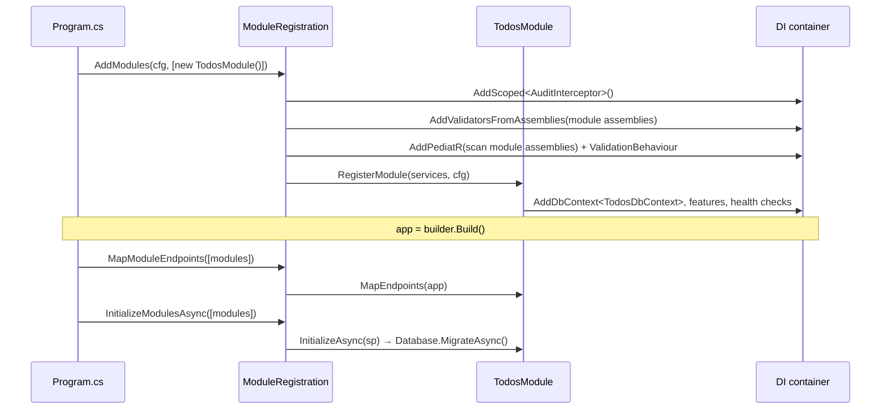

# Modules

A **module** is a self-contained vertical slice of the application, living in a
single project under `src/Modules/`. It owns its domain, application logic,
persistence (schema + migrations), and HTTP endpoints. The host only ever sees
it through the `IModule` contract.

The `Todos` module is the reference implementation used throughout these docs.

## Anatomy

```
src/Modules/Todos/
├── Todos.csproj              # references ONLY BuildingBlocks
├── Usings.cs                 # global usings for the module
├── TodosModule.cs           # IModule implementation
├── Domain/
│   └── TodoEntity.cs         # inherits BaseEntity
├── Application/
│   ├── ITodosDbContext.cs    # the module's data contract
│   ├── TodoFeatures.cs       # [Query]/[Command] feature methods
│   ├── Commands/             # CreateTodoCommand, UpdateTodoCommand, DeleteTodoCommand
│   ├── Views/                # CreateTodoView, UpdateTodoView, TodoView
│   ├── Validators/           # FluentValidation validators
│   └── Mapping/              # Mapperly [Mapper]
├── Infrastructure/
│   ├── TodosDbContext.cs     # : ModuleDbContext, ITodosDbContext — schema "todos"
│   ├── TodosDbContextFactory.cs   # design-time factory for `dotnet ef`
│   ├── Configurations/       # EF IEntityTypeConfiguration<>
│   └── Migrations/           # generated per-module migrations
└── Endpoints/
    └── TodoEndpoints.cs      # minimal API group (internal)
```

Note the inner folders echo the layering (`Domain` / `Application` /
`Infrastructure`) — but scoped **to the feature**, not to the whole app. That's
the modular-monolith trade: the same separation of concerns, packaged by feature.

## The `IModule` contract

```csharp
public interface IModule
{
    Assembly Assembly { get; }
    IServiceCollection RegisterModule(IServiceCollection services, IConfiguration configuration);
    IEndpointRouteBuilder MapEndpoints(IEndpointRouteBuilder endpoints);
    Task InitializeAsync(IServiceProvider services) => Task.CompletedTask;
}
```

| Member | Responsibility |
|--------|----------------|
| `Assembly` | The assembly the host scans for validators + mediator handlers. |
| `RegisterModule` | Register the module's `DbContext`, feature classes, health checks, and any module-specific services. |
| `MapEndpoints` | Map the module's HTTP endpoints. |
| `InitializeAsync` | Optional startup work — here, applying the module's migrations. Defaults to a no-op. |

### `TodosModule`

```csharp
public sealed class TodosModule : IModule
{
    public Assembly Assembly => typeof(TodosModule).Assembly;

    public IServiceCollection RegisterModule(IServiceCollection services, IConfiguration configuration)
    {
        services.AddDbContext<TodosDbContext>((sp, options) => options
            .UseNpgsql(
                configuration.GetConnectionString("Default"),
                npgsql => npgsql.MigrationsHistoryTable("__ef_migrations_history", TodosDbContext.Schema))
            .UseSnakeCaseNamingConvention()
            .AddModuleInterceptors(sp));

        services.AddScoped<ITodosDbContext>(sp => sp.GetRequiredService<TodosDbContext>());
        services.AddScoped<TodoFeatures>();

        services.AddHealthChecks()
            .AddDbContextCheck<TodosDbContext>("todos-db", tags: ["ready"]);

        return services;
    }

    public IEndpointRouteBuilder MapEndpoints(IEndpointRouteBuilder endpoints)
    {
        endpoints.MapTodoEndpoints();
        return endpoints;
    }

    public async Task InitializeAsync(IServiceProvider services)
    {
        using var scope = services.CreateScope();
        var dbContext = scope.ServiceProvider.GetRequiredService<TodosDbContext>();
        await dbContext.Database.MigrateAsync();
    }
}
```

## Lifecycle

How a module flows through the host at startup:



Because the host scans each module's `Assembly` for validators and handlers,
you never register them by hand — implementing `IModule` and adding the module
to the list in `Program.cs` is enough.

## The module's data contract

A module exposes its persistence to its own application code through a narrow
interface rather than the concrete `DbContext`:

```csharp
public interface ITodosDbContext
{
    DbSet<TodoEntity> Todos { get; }
    Task<int> SaveChangesAsync(CancellationToken cancellationToken = default);
}
```

`TodosDbContext` implements it; feature classes depend on the interface. This
keeps features testable and the persistence swappable. See
[Persistence](persistence.md).

## Rules of thumb

- A module references **only** `BuildingBlocks` — check its `.csproj`.
- Keep the module's public surface small: endpoints in, an interface/event out.
  Everything else can be `internal`.
- Don't query another module's schema. If you need its data, go through a
  contract it exposes (see [Architecture → cross-module communication](architecture.md#cross-module-communication-when-you-need-it)).
