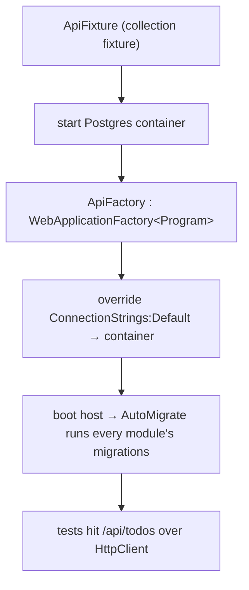

# Testing

Two test projects, both run by `dotnet test` and in CI.

```
tests/
├── ReadyTemplate.UnitTests/          # fast, no dependencies
└── ReadyTemplate.IntegrationTests/   # full stack, real PostgreSQL via Testcontainers
```

## Unit tests

Fast, dependency-free tests for module logic — currently the Todos validators,
using `FluentValidation.TestHelper`.

The project references the **module** directly:

```xml
<ProjectReference Include="..\..\src\Modules\Todos\Todos.csproj" />
```

```csharp
public class CreateTodoViewValidatorTests
{
    private readonly CreateTodoViewValidator _validator = new();

    [Theory]
    [InlineData("")]
    [InlineData("ab")]
    public void Empty_or_short_title_fails(string title)
    {
        var result = _validator.TestValidate(new CreateTodoView { Title = title });
        result.ShouldHaveValidationErrorFor(x => x.Title);
    }
}
```

Run only these:

```bash
dotnet test tests/ReadyTemplate.UnitTests
```

## Integration tests

Full end-to-end tests that host the API with `WebApplicationFactory<Program>`
and a disposable **PostgreSQL 17** container via
[Testcontainers](https://testcontainers.com/). **Docker must be running.**

The project references the **host**:

```xml
<ProjectReference Include="..\..\src\Bootstrapper\Api\Api.csproj" />
```

`Program` is exposed to the test assembly by the trailing
`public partial class Program;` in `Program.cs`.

### How the harness works



- `ApiFactory` overrides configuration in-memory: the container's connection
  string, an empty OTLP endpoint (no telemetry shipped), and
  `Database:AutoMigrate = true` so startup applies the module migrations.
- `ApiFixture` is a collection fixture: one container is shared across the test
  class, warmed once.

```csharp
[Collection(nameof(ApiCollection))]
public sealed class TodoEndpointsTests(ApiFixture fixture)
{
    private readonly HttpClient _client = fixture.Factory.CreateClient();

    [Fact]
    public async Task Deleted_todo_is_soft_deleted_and_excluded()
    {
        var created = await CreateTodo("Temp task");
        var del = await _client.DeleteAsync($"/api/todos/{created.Id}");
        del.StatusCode.Should().Be(HttpStatusCode.NoContent);

        // soft delete + global query filter → no longer found
        var get = await _client.GetAsync($"/api/todos/{created.Id}");
        get.StatusCode.Should().Be(HttpStatusCode.NotFound);
    }
}
```

These tests exercise the whole vertical: routing → validation pipeline →
feature/handler → module `DbContext` → PostgreSQL, including soft delete and the
audit interceptor.

Run only these (needs Docker):

```bash
dotnet test tests/ReadyTemplate.IntegrationTests
```

## Everything + CI parity

```bash
dotnet build ReadyTemplate.slnx -c Release -warnaserror
dotnet test  --no-build --configuration Release
```

CI (`.github/workflows/build.yml`) runs exactly this on every push/PR to
`master`, plus a `docker build` of the image. Any analyzer warning fails the
build (`-warnaserror`).

## Testing a new module

Mirror the pattern: add validator unit tests referencing your module project,
and (optionally) integration tests for its endpoints — the shared `ApiFixture`
already boots every registered module, so a new module's endpoints are reachable
as soon as it's added to `Program.cs`.
